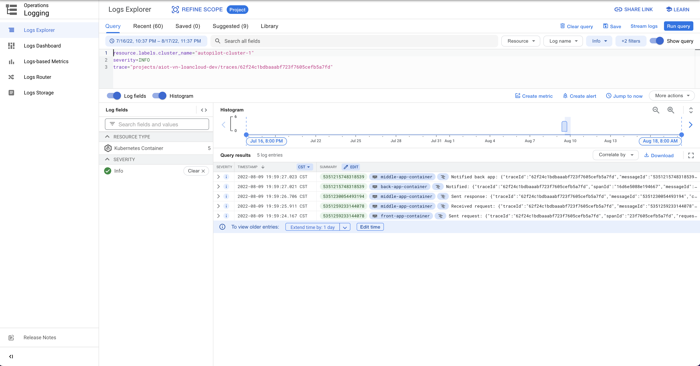

# Tracing events in distributed system

- 在分散式架構下，利用Event
  Correlation串連同一個交易下透過事件溝通的多個相關聯服務，使例外發生時可以快速定位問題的發生點。除上述的目的外，相關聯應用服務的Log也要能在日誌管理工具中快速查找 (
  如Cloud Logging, Elasticsearch/Kibana, ...etc)。
- 事件架構的Tracing有兩個主要的挑戰：
    - 事件的Trace/Span Context無法傳播給其他接收到事件的應用服務。
    - Event架構下，單靠Trace/Span兩欄位不足以串連相關聯服務。

## Scenarios

- 建構三個服務，分別為`Front App`, `Middle App`以及`Back App`，每個服務間均透過Event溝通：
    - `Front App`發送Request Event給`Middle App`，`Middle App`收到Event後執行後續的業務，處理完畢後再回送Response
      Event通知`Front App`。
    - `Middle App`單向發送事件通知`Back App`，`Back App`收到事件後執行後續的業務，不須再回送Event給`Middle App`。
- 示意圖如下：
  

## Solutions

- 為了讓既有的日誌管理工具可以查出同一交易下觸發的所有事件，保留Trace/Span兩欄位，並增加欄位用於串連多個相關聯事件，以及對應Request/Response
  Event，欄位如下圖所示：
  
    - `messageId`: 這個Event的唯一識別ID，這此POC中使用Cloud Pub/Sub所配發的Message ID。
    - `conversationalId`: 代表此次交易的唯一識別碼，在此POC中直接取用`traceId`欄位的結果。
    - `requestorId`: 用於串連Request-Reply Pattern的Event，當看到兩個Event的`requestorId`
      是相同的，即代表這兩個事件一個為Request，另一個則為Response。
    - `initiatorId`: 紀錄上一個Event的`messageId`欄位，說明當前Event是由哪一個Event所觸發，可用於串連多個相關聯Event的上下關係。
        - `requestorId`與`initiatorId`僅有一個欄位會有值，用以區分這個Event是否為Request-Reply Pattern的Event。
- 新增的欄位 (包含`traceId`與`spanId`)存放在Event的attribute區塊，可視為Event的Header，當應用服務收到Event時，將Event
  attributes區塊的資訊寫到MDC中，如此在寫Log時就會自動紀錄該些欄位資訊，同時`traceId`被覆寫，如此就可透過同一個`traceId`
  資訊查找相關聯的所有Log，達到查找同一個交易下所有Event Log資訊的目的。
  

## Disclaimers

- 此專案為POC，僅是為了示範Event Correlation的概念，很多設定直接寫死 (e.g.: MDC)，請不要直接在實際程式中採用這個POC的寫法。

## Build steps

### Setup env variables

- `export APP_VERSION=<specify app  version>`
- `export GCP_PROJECT_ID=<specify your GCP ID>`

### Build images

- `mvn install -pl pubsub-lib`
- `mvn clean package jib:dockerBuild -pl back-app -Dback-app-version=${APP_VERSION}`
- `mvn clean package jib:dockerBuild -pl middle-app -Dmiddle-app-version=${APP_VERSION}`
- `mvn clean package jib:dockerBuild -pl front-app -Dfront-app-version=${APP_VERSION}`

### Tag images

- `docker tag back-app:${APP_VERSION} asia.gcr.io/${GCP_PROJECT_ID}/back-app:${APP_VERSION}`
- `docker tag middle-app:${APP_VERSION} asia.gcr.io/${GCP_PROJECT_ID}/middle-app:${APP_VERSION}`
- `docker tag front-app:${APP_VERSION} asia.gcr.io/${GCP_PROJECT_ID}/front-app:${APP_VERSION}`

### Push images to GCP Container Registry

- `docker push asia.gcr.io/${GCP_PROJECT_ID}/back-app:${APP_VERSION}`
- `docker push asia.gcr.io/${GCP_PROJECT_ID}/middle-app:${APP_VERSION}`
- `docker push asia.gcr.io/${GCP_PROJECT_ID}/front-app:${APP_VERSION}`

### Deploy artifacts to GKE

- `kubectl apply -f kubernetes-back-app-gcp.yaml`
- `kubectl apply -f kubernetes-middle-app-gcp.yaml`
- `kubectl apply -f kubernetes-front-app-gcp.yaml`

### Optional steps

#### Remove all related images in Docker

- `docker rmi -f $(docker images front-app -q)`
- `docker rmi -f $(docker images middle-app -q)`
- `docker rmi -f $(docker images back-app -q)`

#### Remove all related images in GCP Container Registry

- `gcloud container images delete asia.gcr.io/${GCP_PROJECT_ID}/back-app:<image version> --force-delete-tags`
- `gcloud container images delete asia.gcr.io/${GCP_PROJECT_ID}/middle-app:<image version> --force-delete-tags`
- `gcloud container images delete asia.gcr.io/${GCP_PROJECT_ID}/front-app:<image version> --force-delete-tags`

## Result
- 可在Cloud Logging中使用Trace ID資訊找出同一交易下相關連的事件Log。

## Unsolved Problems
- 未找出事件丟失的根因，如上圖的Front App是沒有收到Middle App的Response Event。

## Possible Improvements

- Request-Reply
  Pattern的Event可明確標示Event是Request或Response，因為在日誌管理工具中紀錄的Log時間為收到Log的時間，不是Log實際發生的時間，因此無法保證如同Event發生的順序。
- 在此POC新增的欄位有一個為`messageId`
  ，這邊採用Cloud Pub/Sub產生的Message Id，即代表這個事件必須成功傳送到Cloud Pub/Sub並等待其成功回應應用服務，應用服務才能取得Message
  ID，或許Message Id可以考慮自行控制產生，可使用UUID、Snowflake等演算法產生Message
  ID。
- 可增加Event Type，使Event更具識別性。